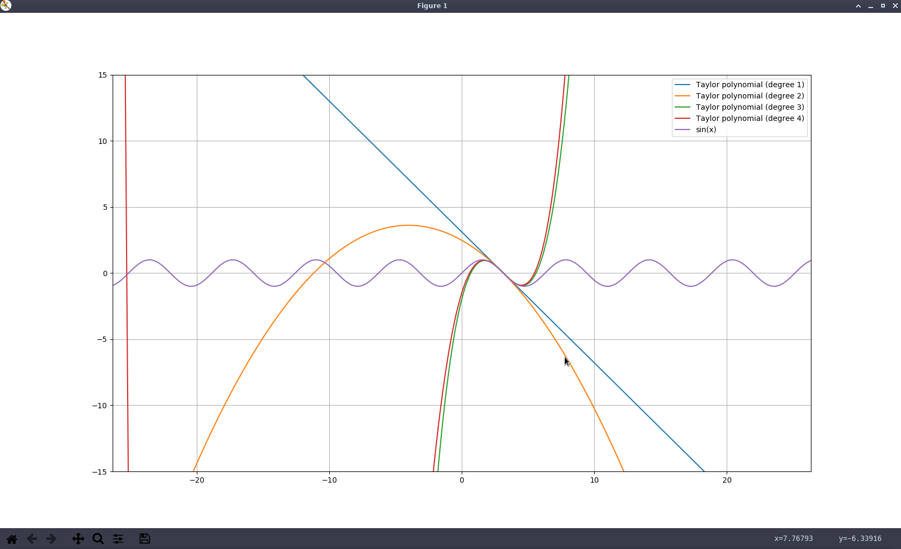

# taylor-series
A simple program to visualize Taylor polynomials approximations.



## How to use

**Step 1: enter a function**

You have to type your function using Python's mathematical operators, e.g., x\*\*2 + 7 - 3\*x.
https://en.wikibooks.org/wiki/Python_Programming/Basic_Math#Mathematical_Operators

You can use the following trigonometric functions inside your function:
- **sin(x)**
- **cos(x)**
- **tan(x)**
- **sec(x)**
- **csc(x)**
- **cot(x)**
- **asin(x)**
- **acos(x)**
- **atan(x)**
- **acsc(x)**
- **acot(x)**

*Note: Even though factorial isn't a trigonometric function you can also use it by calling **factorial()**.*

**Step 2: enter "a"**

*Whats "a"?*


**Step 3: enter the the degree of the Taylor polynomial**

Enter the degree of each polynomial one at a time.
In order to finally plot the graph end it with a -1, so that the program knows it is ready.

```bash
$ ./Desktop/taylor-series/main.py 
Enter a function:
f(x) = tan(cos(x)-2\*sin(x/2))
a = 3
Enter the degree of the Taylor polynomial: 3
Enter the degree of the Taylor polynomial: 5
Enter the degree of the Taylor polynomial: 7
Enter the degree of the Taylor polynomial: -1
```
